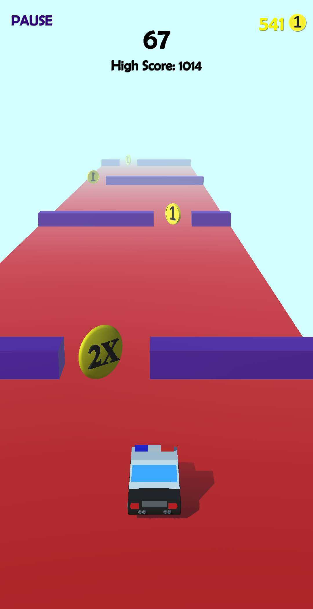

# Pass-The-Hurdles

      

 

* Made an infinite runner, "Pass the Hurdles" for Android.
* In which you have to avoid the hurdles and collect the coins.
* You can unlock the four different characters with the coins.
* Implemented Unity Ads API in it and Uploaded it to Google Play Store.

**Technology Used: Unity**  
**Time Period: December 2019 – March 2020**  

&ensp;&ensp;&ensp;
